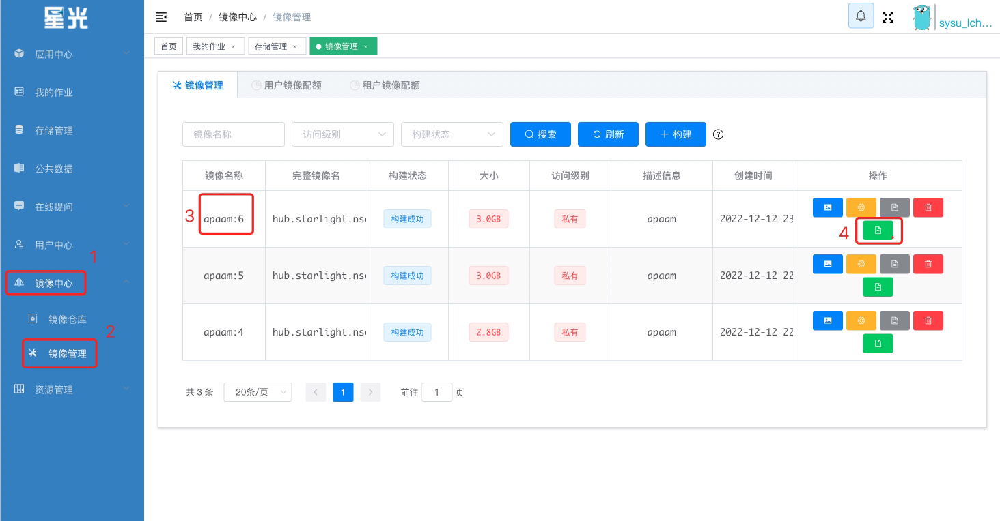
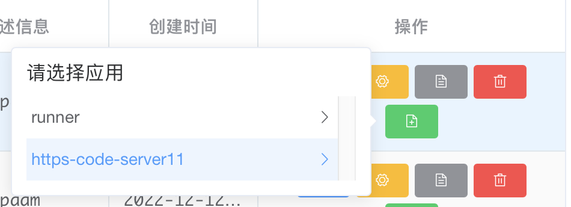
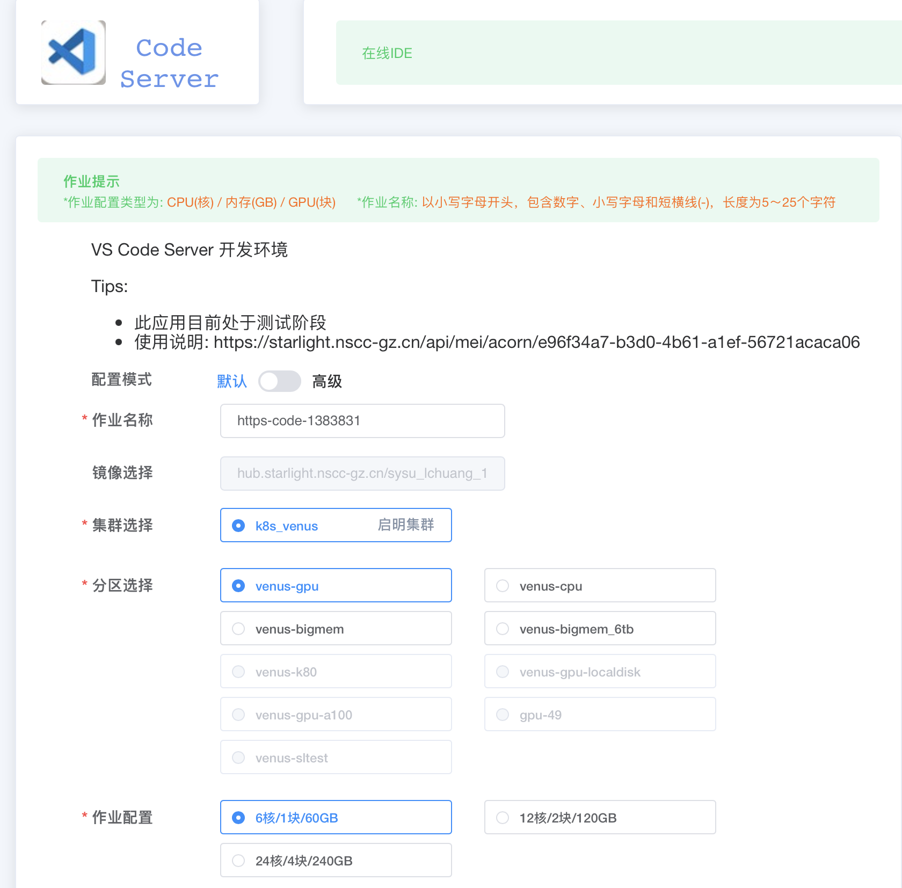
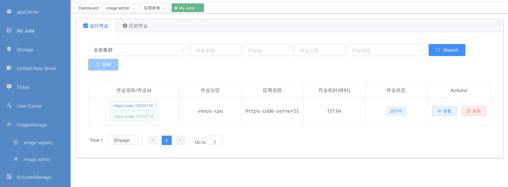
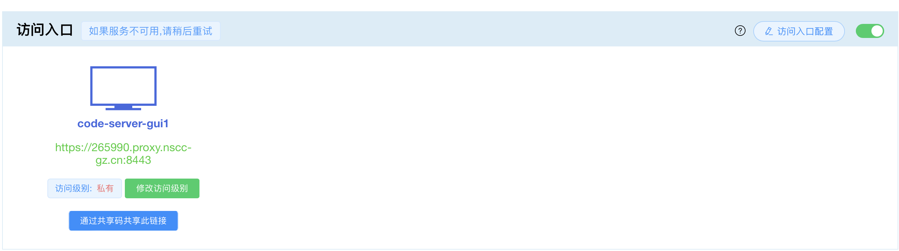
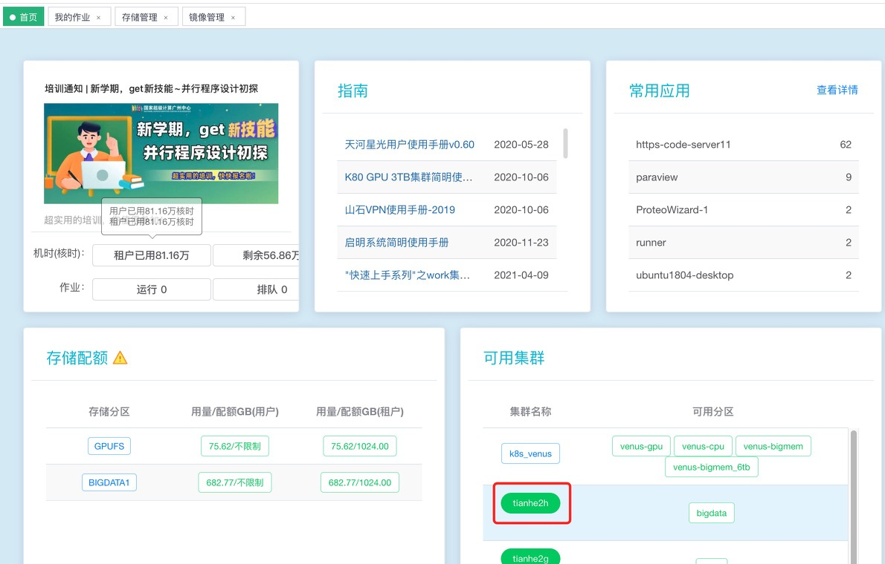
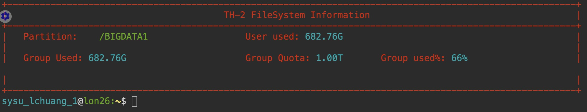
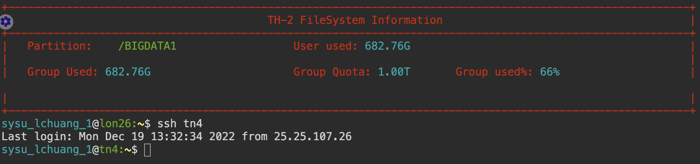
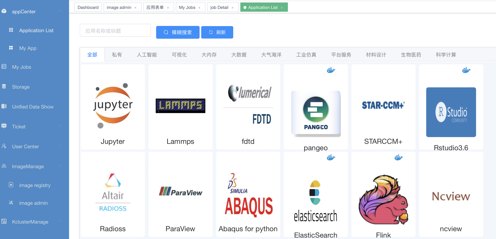
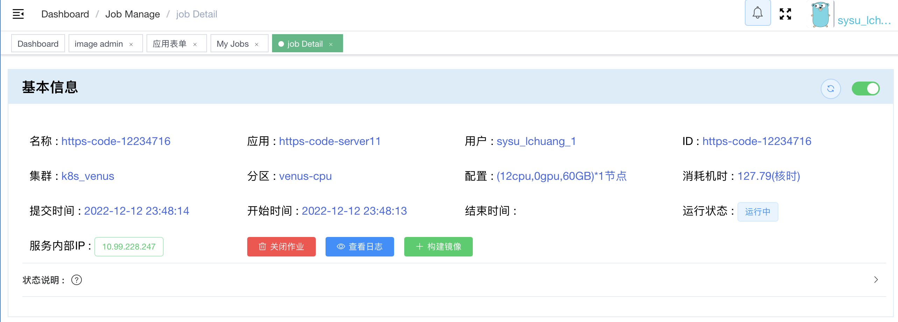

本教程为NetDEM及相关软件在天河二号星光平台上使用的说明教程。

更新时间为2022-12-22。

天河星光的网址：[星光 (nscc-gz.cn)](https://starlight.nscc-gz.cn/)

账号：laizhengsh@mail.sysu.edu.cn

密码：Lzhshou1990

在镜像管理-找到相应的镜像，如最新的apaam:6

提交作业，选择https-code-server11

选择相应的节点，并提交作业（注，下图为默认的配置，可按需要选择相应的计算节点，如venus-cpu，12核/60GB）

在我的任务，找到对应的任务、点击查看。（可以理解为这就是一个虚拟机在跑。跑完之后记得结束作业，不然会一直使用核时数的）

通过最下端的入口，进入vscode的网页端，进行相应的脚本编辑、计算等（跟平时操作一致）。

 目前版本的镜像使用方式是跑在GPUFS集群上。

请在/GPUFS/sysu_lchuang_1/目录下新建自己的文件夹，以免误操作他人数据。

使用前请在上传计算所需数据至个人文件夹，计算所得数据也存在于该文件夹中。（快速上传可使用UDT客户端传输，具体教程可见天河星光平台。）

 数据后处理：

 1、可通过下载数据至本地后进行本地后处理（MATLAB/Paraview）。

2、在线处理数据。（数据较大时建议采用这种方式。）

在星光首页，单击tianhe2h，进入ssh命令行。

单击后进入以下视图。

输入ssh tn4 进入数据传输的节点。

cp -rf(如果需要传文件夹) /GPUFS/sysu_lchuang_1/xxxx /BIGDATA1/sysu_lchuang_1/xxxx (注意个人文件夹！！！)  （linux命令）

可在APP中心建立paraview任务，进行远程可视化。

 注：

在镜像中如果进行了系统库更新等，如apt-get install xxxx，下次提交作业时，更新将丢失。为了保存更新，可以将当前的镜像状态保存为新的镜像，即下图的“构建镜像”。构建的镜像可在“镜像管理”中找到。

 注：

运行程序时，如./Allrun-parallel，当关闭终端或退出网页时，程序将中断。可使用./Allrun-parallel &运行程序，当关闭终端或退出网页时，程序将继续执行。

注：

当关闭终端或退出网页时，天河星光上的任务（即我们提交的vscode这个镜像容器任务）还在继续执行。需找到对应的作业并关闭。

注：

现阶段，请暂时不要修改apaam中的代码。若需要更新代码，小组集中讨论后再更新，以防版本冲突。

 

注：

可按上述操作提交多个任务，进行并行计算。一个超算任务/作业即即相当于一台电脑，因此需注意申请的计算核心数和将要执行的程序的计算核心数；不同超算任务/作业之间相互独立，即相当于不同电脑。

 

注：

请在分区下建立自己的文件夹，将数据保存在自己的文件夹下，以免被其他人误操作了数据。

